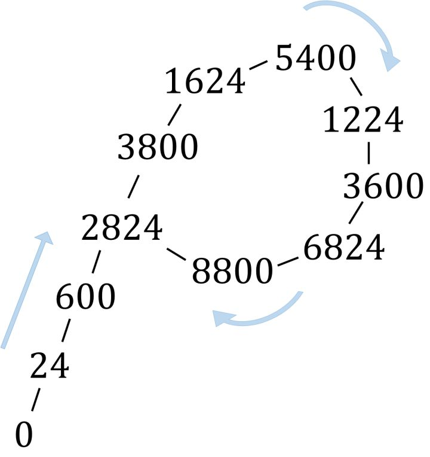
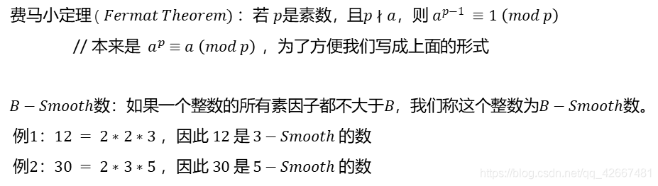
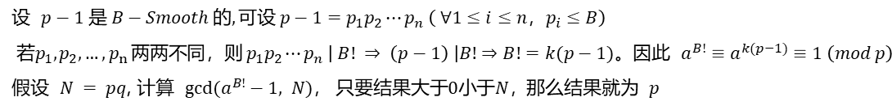
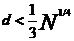
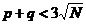

**公钥密码学数学基础实验报告**

**实验2·同余的应用**

组 别： ********

学 院： 网络空间安全学院（研究院）

班 级： ******

组 长： TS

组 员： LX，YJ，NZY

2022年10月8日

**实验四.素数分解**

*Prime decomposition*


[报告摘要]

对整数分解问题的研究具有重要意义。RSA是公钥密码学中著名的算法，1977 年

由 Rivest, Shamir 和 Adleman 一起提出, 在实际中有着广泛的应用. RSA 算法的安全性依赖于大整数分解困难, 这使得整数分解问题成为现代密码学非常关注的问题之一。整数分解为给定正整数 N, 求 N 的素因子, 即求整除 N 的素数。本次实验旨在掌握整数分解的原理和基本方法，至少使用三种方法实现整数分解，并且比较各方法的优缺点。

关键词：整数分解 RSA加密 试除法 Pollard 算法

[Abstract]

The research of integer decomposition is of great significance. RSA is a famous public key cryptography algorithm, which was proposed in 1977 and has been widely used in practice. The security of RSA algorithm depends on the difficulty of large integer factorization，This makes integer decomposition one of the most important problems in modern cryptography.

The purpose of this experiment is to master the basic principle of integer decomposition, master the commonly used integer decomposition methods, at least three decomposition methods are used, and compare the advantages and disadvantages of each method

Keywords: Prime decomposition, RSA, Pollard algorithm.

**目录**

[摘要 2](#_Toc115729539)

[参考文献 11](file:///C:\Users\waldeinsamkeit\Desktop\实验1.docx#_Toc115729546)

# 试除法原理，代码实现及复杂度分析

## 试除法基本原理

设 N 是一个正整数, 试除法看成是用小于等于根号N 的每个素数去试除待分解的整数. 如果找到一个数能够整除除尽, 这个数就是待分解整数的因子. 试除法是最初等的整数分解算法, 该方法思想简单, 但能够快速分解出 N 中的小素因子。试除法的原理简单，是暴力破解的思想，效率较低，但不失为一种思路简洁的方法。

使用试除法时需要找到小于根号N的素数，我们可以根据写出的一个素数找到下一个素数，具体实现代码如下：

1. ```c++
   1.  int i = 2, n = 0, flg = 1;
   2.  scanf("%d", \&n);
   3.  while (n++)
   4.  {
   5.  i = 2;*//如果不是上一个值不是素数刷新i的值继续试除下一个数；*
   6.  flg = 1;*//刷新标志符；*
   7.  while (i \< n)
   8.  {
   9.  if (n % i == 0)
   10.  {
   11.  flg = 0;
   12.  break;
   13.  }
   14.  i++;
   15.  }
   16.  if (flg == 1)
   17.  break;
   18.  }
   19.  printf("%d", n);
   ```

   

之后使用生成的素数进行试除法的检索。

## 1.2试除法的NTL实现和Sage实现

由1.1的分析，代码实现如下

（此位置贴上一个试除法的代码）

## 1.3结果讨论

### 1.3.1复杂度分析

由试除法原理可知，在最坏的情况下，我们需要遍历2-根号N中所有素数，又由数学知识可知，当N很大时，φ（N）的值接近于logN。如果用时间复杂度衡量试除法的效率，则时间复杂度约为O（φ（N））≈O（logN）（lim N-\>正无穷）。

### 1.3.2优缺点分析

试除法的优点在于其思路简洁，容易理解，尽管实际世界中试除法早已被淘汰，但是不可否认的是试除法仍然是程序设计者在需要验证质数时的第一反应和选择。简单的结构和代码以及其背后所解决的问题的复杂程度使这个算法至今仍颇具魅力。我们从中也可以感受到暴力破解的思想及其优化过程。至于素数测试，好的算法层出不穷。确定型算法如埃拉托斯特尼筛法，AKS质数测试；随机演算法如费马素性测试，米勒检验等等。试除法的缺点在于其循环遍历次数太多，导致计算量大，效率极低，是较为简陋的算法实现，不能在实际的大素数分解问题中很好的解决。

# 2.Pollard ρ算法

## 2.1Pollard ρ算法原理



Pollard-Rho算法是John Pollard发明的一种能快速找到大整数的一个非1、非自身的因子的算法。找到素因子的一种思想是随机生成一个数，判断是否是N的因子，这种办法正是Pollard-Rho算法的基础。在最差的情况下，N=p\^2（假设p为素数）只有一个素因子，即p，最差时时间复杂度为O（N\^(1/2)\*logN）（logN是判断是否为素数需要的时间）。这种办法连朴素的试除法都比不过。

**2.1.1 生日悖论**

对上述例子进一步优化需要用到生日悖论。它可以表述为：一个房间里有23个人，则他们中有两人生日相同的概率超过一半（不考虑闰年）。生日悖论启示我们，如果我们不断在某个范围内生成随机整数，很快便会生成到重复的数，期望大约在根号级别。精确地说，对于一个 [1,N] 内整数的理想随机数生成器，生成序列中第一个重复数字前期望有（ΦN/2）\^(1/2)个数.对于本题来说，即使在最坏的N=p\^2的情况下，只要在期望生成大约N\^1/4个模p下的随机数，则会出现两个相同的。而这两个数做减法得到的d一定是modp余0的数。但这件事意义并没有那么大。正如虽然生日悖论是正确的，但你不一定能在班上遇到和自己生日相同的人，因为这个高概率是在两两比较下才成立的。

所以如果我们对生成的N\^1/4个数两两比较，则时间复杂度立刻退回到O（N\^(1/2)\*logN），于是我们需要进一步优化。

**2.1.2 伪随机数序列**

伪随机数序列：Pollard使用一种特别的伪随机数生成器来生成[0,N-1]中的伪随机序列：

设第一个数为x，f(x)=(x\^2+c) mod N，则x, f(x), f(f(x)).....构成一个伪随机序列。每个数都是由前一个数决定的，可以生成的数又是有限的，那么迟早会进入循环。当然，这个循环很可能是混循环，所以生成的序列常常形成这样的ρ型，所以Pollard将其命名为ρ算法。我们在这里使用**Floyd判环算法，**设置两个变量t，r，每次判断GCD（（t-r），N）是否为1，如不为1，则t=f（t），r=f（f（r）），因为r跑得更快，如果没有找到合适的解，则二者最终会在t环上相遇。此时说明t环上没有解，我们需要再随机生成随机数进行ρ算法。

Ps：合理性：每次二者的移动都相当于在检查一个新的距离，最终会检测到所有距离是否符合。另外，由同余知识可知，不论在哪个位置，只要间隔数一样，两数做差modN结果一样，所以不必从每个位置开始检测所有间隔。

## 2.2 Pollard ρ算法实现

### 2.2.1 NTL实现

### 2.2.2 Sage实现

## 2.3 Pollard ρ算法分析

Pollard Rho 是一个很神奇的算法，用于在 O(n1/4) 的期望时间复杂度内计算合数n的某个非平凡因子（除了1和它本身以外能整除它的数）。事书上给出的复杂度是 O(√p) ， p 是 n 的某个最小因子，满足 p 与 n/p 互质。虽然是随机的，但 Pollard Rho 算法在实际环境中运行的相当不错，不会被卡。

**2.3.1 Pollard ρ算法优化**

在我们的方法中，我们可以让y根据生成公式以比x快两倍的速度向后生成，这样当y再次与x相等时，x一定跑完了一个圈且没重复跑很多，第一次优化我们可以采用倍增的办法，让y记住x的位置，然后x再跑当前跑过次数的一倍的次数。这样不断让y记住x的位置，x再往下跑，因为倍增所以当x跑到y时，已经跑完一个圈，并且也不会多跑太多。该函数的实验（部分）如下：

1. ```c++
   1.  inline ll rho(ll n){
   2.  ll x,y,c,g; rg i,j;
   3.  x=y=rand(); c=rand();*//初始化*
   4.  i=0,j=1;*//倍增初始化*
   5.  while(++i){
   6.  x=(ksc(x,x,n)+c)%n;*//x只跑一次*
   7.  if(x==y)break;*//跑完了一个环*
   8.  g=gcd(Abs(y-x),n);*//求gcd（注意绝对值）*
   9.  if(g\>1)return g;
   10.  if(i==j)y=x,j\<\<=1;*//倍增的实现*
   11.  }
   12.  }
   ```

   

不足之处：其实Pollard ρ算法的时间复杂度不是O（），因为每一次比较都要求一次GCD的值，所以其实时间复杂度还要乘以logN。

# 3.Pollard p-1算法

## 3.1Pollard p-1算法原理





如果p1,p2.....pn在小于B的范围内选取，则两数不同的概率很大，则大概率能够分解。

## 3.2Pollard p-1算法的NTL和Sage实现

### 3.2.1 NTL实现

### 3.2.2 Sage实现

## 3.3Pollard p-1算法分析

不足：但是我们显然看到：该方法假设p-1被分解成不同的小于B的因子的乘积，所以在有相同因子情况下，则该方法不能很好的跑出结果。

优化：在能跑出结果的情况下，我们可以对该算法进行优化，例如(a\^B-1，N)与(a\^B-1modN,N)效果相同，显然计算后者时间短；此外，我们不需要每次都计算gcd，从＜B的数中选取因子，其中最大的素数大概率要超过0.8B，所以在0-0.8B之间不计算gcd，节省时间。

# 4.其他算法

## 4.1费马基于二次同余的方法

### 4.1.1简介

费马曾提出一个基于二次同余的想法, 即如果可以找到正整数 s, t 满足 s\^2 ≡ t\^2(mod N), 则gcd(s ± t, N) 可能是 N 的一个非平凡因子，为了提高搜寻s和t的效率，我们引入分解基概念。

### 4.1.2分解基

一个分解基是不超过某个上界 B 的素数集合, 若一个正整数的素因子均在该分解基中, 则称为 B-光滑的. 分解基方法的基本思想是生成一批满足 x\^2(mod N) 是B-光滑的整数 x, 然后根据它们在分解基上的分解构造出整数 s, t 满足s\^2=t\^2。这样可以提升搜寻效率。

### 4.1.3基于连分数的分解方法

连分数可以用于对RSA算法的低解密指数攻击，当公钥e很大时，我们选取小的解密指数d，例如智能卡与大型计算机（服务器）之间的通信，用于智能卡自身计算能力的限制，通常选取小的解密指数d，服务器使用大的加密指数e。

Weiner提出利用连分数方法攻击小解密指数的RSA。当，可以分解RSA mod N。Weiner的分析方法为：假设mod N的两个大素因子p和q的二进制长度相等，p\<q\<2p，则，N的欧拉函数Φ(N)=N-p-q+1，有ed=1+kΦ(N).

由0\<k\<d，，则，当时，有。

由连分数知识，k/d是e/N（后者为有理数）的一个渐进分数。

参考资料：

[1] 王小云,王明强,孟宪萌.公钥密码学的数学基础[M] 北京:科学出版社 2013.1

[2] Kenneth H.Rosen.初等数论及其应用[M] 北京：机械工业出版社，2015.2
